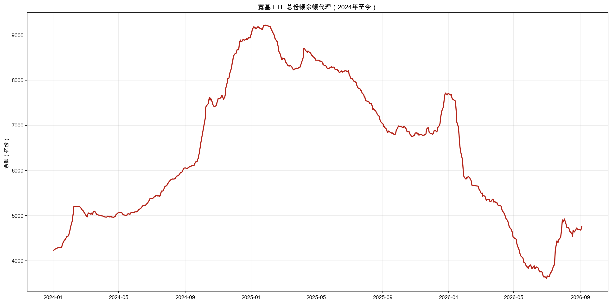
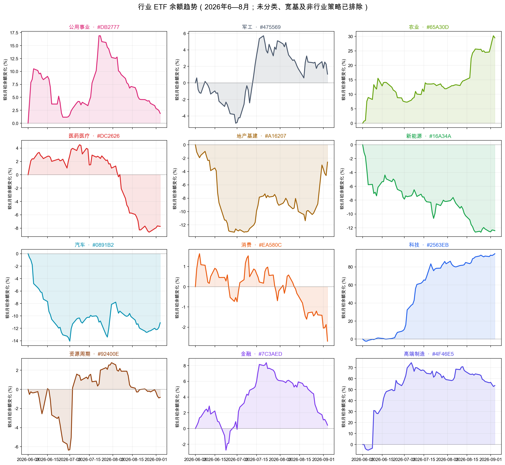
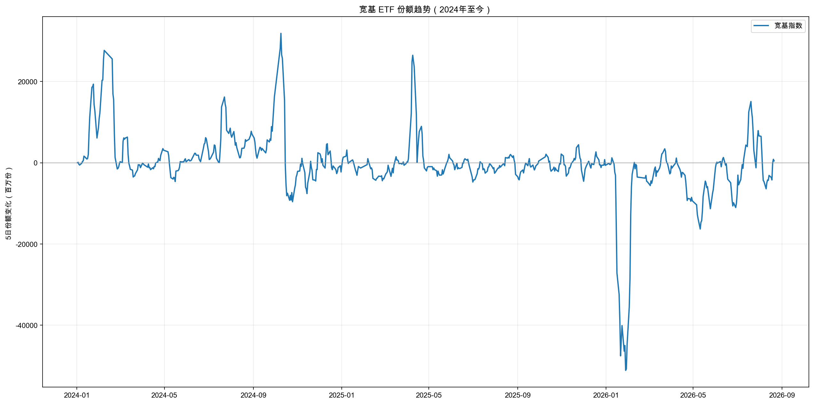
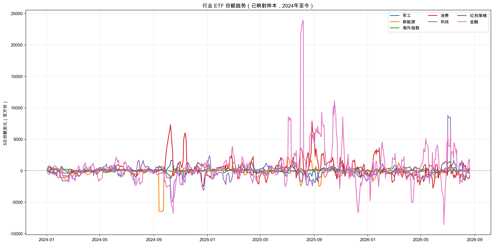

# 国家队 ETF 跟踪与行业资金流向看板

一个用于跟踪沪深 ETF 基金份额、观察宽基 ETF 余额代理和行业 ETF 申赎变化的研究型数据项目。

> **重要声明**：ETF 基金份额变化只能作为申赎和指数化资金配置的代理指标，不能直接等同于国家队真实持仓。项目输出不构成投资建议。

## 功能

- 使用 AKShare 采集上海证券交易所 ETF 日基金份额
- 使用 AKShare 采集深圳证券交易所 ETF 区间日基金份额
- 支持导入深交所手动下载的 CSV/XLS/XLSX/TSV 文件
- 按 `date + market + code` 合并、去重和生成质量报告
- 维护 ETF 与行业的映射关系
- 对未分类 ETF 做宽基、港股/海外、债券/货币、商品、策略类、区域主题和待人工确认等细分
- 计算 ETF 份额变化、行业聚合和粗略资金代理
- 绘制 2024 年至今宽基 ETF 总份额余额代理趋势
- 绘制 2026 年 6—8 月行业 ETF 余额趋势
- 生成离线 HTML 看板和 CSV/PNG 结果
- 将超大 CSV 拆分为 GitHub 友好的分片文件，并支持重新合并

## 数据范围

当前仓库中的历史数据覆盖：

```text
2024-01-02 至 2026-08-21
```

原始年度数据位于：

```text
skills/national-etf-tracker/data/raw/annual/
```

## 快速开始

### 环境

建议使用 Python 3.10+：

```bash
pip install -U "akshare>=1.18.52" pandas matplotlib openpyxl
```

本项目实测使用过 AKShare 1.18.88。

### 生成主看板

如果已经有统一格式的 ETF 数据：

```bash
python skills/national-etf-tracker/scripts/build_dashboard.py \
  --input skills/national-etf-tracker/data/processed/etf_shares.csv \
  --mapping skills/national-etf-tracker/config/industry_mapping.csv \
  --output-dir skills/national-etf-tracker/output
```

打开：

```text
skills/national-etf-tracker/output/national_etf_dashboard.html
```

## 数据采集

### 沪市 ETF 份额

沪市使用按日期查询的接口，脚本会逐交易日调用：

```bash
python skills/national-etf-tracker/scripts/collect_sse_akshare.py \
  --start-date 2026-08-01 \
  --end-date 2026-08-31 \
  --output skills/national-etf-tracker/data/raw/annual/sse_2026_aug.csv
```

接口：

```python
ak.fund_etf_scale_sse(date="YYYYMMDD")
```

非交易日或接口返回异常结构会被跳过，并在终端输出警告。

### 深市 ETF 份额

深市接口单次建议不超过约 6 个月：

```bash
python skills/national-etf-tracker/scripts/collect_szse_akshare.py \
  --start-date 2026-07-01 \
  --end-date 2026-08-31 \
  --output skills/national-etf-tracker/data/raw/annual/szse_2026_q3.csv
```

接口：

```python
ak.fund_scale_daily_szse(
    start_date="YYYYMMDD",
    end_date="YYYYMMDD",
    symbol="ETF",
)
```

如果 AKShare 接口不可用，可以把交易所下载文件放入：

```text
skills/national-etf-tracker/data/raw/shenzhen/
```

然后执行：

```bash
python skills/national-etf-tracker/scripts/import_shenzhen.py \
  --input-dir skills/national-etf-tracker/data/raw/shenzhen
```

## 合并与质量检查

将多个来源文件合并：

```bash
python skills/national-etf-tracker/scripts/merge_sources.py \
  --inputs skills/national-etf-tracker/data/raw/annual/*.csv \
  --output skills/national-etf-tracker/data/processed/etf_shares.csv \
  --report skills/national-etf-tracker/data/processed/quality_report.json
```

输出：

```text
skills/national-etf-tracker/data/processed/etf_shares.csv
skills/national-etf-tracker/data/processed/quality_report.json
```

标准字段：

```text
date, source, market, code, name, shares,
share_unit, close, industry, source_file
```

其中 `shares` 和 `share_unit` 的份额单位统一为“份”，不会对交易所接口结果重复乘以 10,000。

## 分片数据恢复

为避免 GitHub 单文件过大，仓库中的两个大 CSV 已拆分保存。

### 主份额数据

```text
skills/national-etf-tracker/data/processed/etf_shares_parts/
```

恢复完整文件：

```bash
python skills/national-etf-tracker/scripts/split_csv.py merge \
  --parts-glob 'skills/national-etf-tracker/data/processed/etf_shares_parts/*.csv' \
  --output skills/national-etf-tracker/data/processed/etf_shares.csv
```

### ETF 明细数据

```text
skills/national-etf-tracker/output/etf_detail_parts/
```

恢复完整文件：

```bash
python skills/national-etf-tracker/scripts/split_csv.py merge \
  --parts-glob 'skills/national-etf-tracker/output/etf_detail_parts/*.csv' \
  --output skills/national-etf-tracker/output/etf_detail.csv
```

分片脚本：

```text
skills/national-etf-tracker/scripts/split_csv.py
```

## 行业分类

基础人工映射：

```text
skills/national-etf-tracker/config/industry_mapping.csv
```

自动分类结果：

```text
skills/national-etf-tracker/output/industry_classification_auto.csv
```

2026 年 6—8 月趋势图实际使用的 ETF 清单：

```text
skills/national-etf-tracker/output/industry_etf_membership_2026.csv
```

自动分类会将 ETF 分为科技、医药医疗、金融、新能源、消费、军工、资源周期、汽车、农业、地产基建、高端制造、公用事业等行业，同时单独识别：

- 宽基/综合指数
- 港股/海外
- 债券/货币
- 商品
- 策略类
- 区域主题
- 待人工确认

名称关键词分类仅用于研究辅助，建议对重要 ETF 进行人工复核。

## 效果图预览

### 综合趋势页面

[打开在线 HTML 看板](skills/national-etf-tracker/output/trend_charts_balance_industry_2026.html)









> 图片均为仓库内生成结果。行业图只统计已通过映射或名称规则归入明确行业的 ETF；宽基图是 ETF 总份额余额代理，不是监管披露的国家队绝对持仓。

## 趋势图与结果

### 综合趋势页面

```text
skills/national-etf-tracker/output/trend_charts_balance_industry_2026.html
```

### 宽基余额代理图

```text
skills/national-etf-tracker/output/broad_estimated_balance_2024_to_present.png
```

宽基图展示的是宽基 ETF 总份额余额代理，不是监管披露的国家队实际持仓余额。若没有外部已知持仓锚点，不能把该序列解释成国家队绝对余额。

### 行业趋势图

```text
skills/national-etf-tracker/output/industry_trend_2026_06_07_08.png
```

行业图使用 2026 年 6 月至 8 月数据，并按各行业相对于 2026-06-01 的份额余额变化百分比展示，避免大规模类别压缩小行业曲线。

### 其他结果

```text
skills/national-etf-tracker/output/industry_trend_2026_06_07_08.csv
skills/national-etf-tracker/output/broad_estimated_balance_2024_to_present.csv
skills/national-etf-tracker/output/industry_daily.csv
```

## 目录结构

```text
.
├── README.md
├── skills/national-etf-tracker/
│   ├── SKILL.md
│   ├── config/
│   │   └── industry_mapping.csv
│   ├── data/
│   │   ├── raw/
│   │   └── processed/
│   │       ├── etf_shares_parts/
│   │       └── quality_report.json
│   ├── output/
│   │   ├── etf_detail_parts/
│   │   ├── *.csv
│   │   ├── *.png
│   │   └── *.html
│   └── scripts/
│       ├── collect_sse_akshare.py
│       ├── collect_szse_akshare.py
│       ├── collect_years.py
│       ├── import_shenzhen.py
│       ├── merge_sources.py
│       ├── plot_trends.py
│       └── split_csv.py
├── findings.md
├── progress.md
└── task_plan.md
```

## 口径与限制

- ETF 份额变化是申赎和配置代理，不等于国家队真实买入或持仓。
- 份额余额不等于资金市值；价格变化需要单独考虑。
- `shares_change * previous_close` 只是粗略资金代理。
- 单日份额大增可能来自联接基金、做市、套利、产品调整或数据修订。
- 不同交易所的数据披露时点可能不同。
- 自动行业分类可能存在误判，重要结论应结合基金合同、跟踪指数和基金公告复核。
- 项目仅用于数据研究，不构成投资建议。

## GitHub

项目仓库：

```text
https://github.com/wiiliw/-ETF-
```
